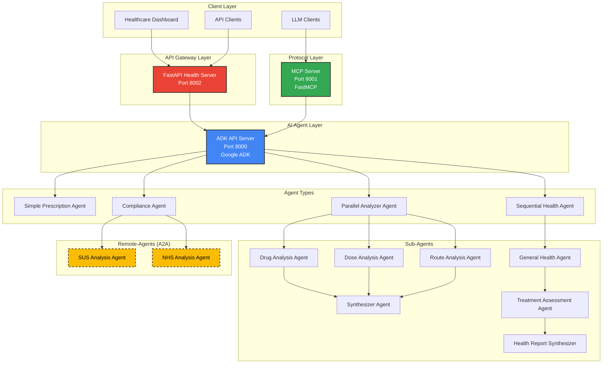

# 🏥 ADK Health Analysis System

**AI-Powered Prescription Safety for Brazil's Public Healthcare System (SUS)**

An intelligent health analysis platform leveraging Google's Agent Development Kit (ADK) to prevent medication errors, reduce adverse drug reactions, and save lives in Brazil's unified healthcare system.

## 🎯 Impact for SUS

### The Problem
- **1 in 8 patients** in Brazil's public healthcare network receive interacting drug combinations
- **1 in 25 patients** receive high-risk drug interactions that could lead to serious adverse events
- **24.7 million** Brazilians are served annually through Farmácia Popular alone (85% of municipalities)
- Global medication error costs: **~$42 billion USD annually**

*Source: Longitudinal analysis of 18-month EHR data from Blumenau (SC), Brazil*

### Our Solution Impact

#### **Lives Saved Annually** 🫀
- **Conservative**: ~100-200 lives
- **Base Scenario**: ~200-400 lives  
- **Optimistic**: ~300-600 lives

#### **Adverse Events Prevented** ⚡
- **Conservative**: ~10,000-20,000 events/year
- **Base Scenario**: ~20,000-40,000 events/year
- **Optimistic**: ~30,000-60,000 events/year

#### **Healthcare Professional Time Saved** ⏰
- **500,000+ hours annually** freed up for patient care
- **300-500 FTE capacity** liberated for other critical activities
- **2 minutes saved** per automated prescription analysis

## 🔧 Architecture Overview

Our system deploys three intelligent analysis layers:

<!-- ```mermaid
graph TD
    A[Patient Data + Prescription] --  B[ADK API Server]
    B -- C[Simple Prescription Agent]
    B -- D[Parallel Analyzer Agent]  
    B -- E[Sequential Health Agent]
    
    D -- F[Drug Analysis]
    D -- G[Dose Analysis] 
    D -- H[Route Analysis]

    F -- I[Synthesizer]
    G -- I
    H -- I
    
    E -- J[General Health Assessment]
    E -- K[Treatment Impact Analysis]
    E -- L[Health Report Synthesis]
    
    C -- M[MCP Server]
    I -- M
    L -- M
    M -- N[FastAPI Health API]
    N -- O[Healthcare Dashboard]
``` -->



### Deployment Infrastructure
- **Google Cloud Run** for scalable containerization
- **Docker Compose** for local development and testing
- **Multi-agent architecture** for comprehensive analysis
- **REST API** for healthcare system integration

## 🤖 AI Agent Types

| Agent | Type | Analysis Focus | Output |
|-------|------|----------------|--------|
| **Simple Prescription** | Single Agent | Overall safety assessment | `overall_criticality` (low/medium/high) |
| **Parallel Analyzer** | Parallel Multi-Agent | Drug interactions, dosing, routes | `drug_criticality`, `dose_criticality`, `route_criticality` |
| **Sequential Health** | Sequential Multi-Agent | Comprehensive health impact | Treatment duration, compliance risk, lifestyle impact, monitoring frequency |

### Clinical Decision Support Features
- **Drug-Drug Interaction (DDI) Detection**
- **Dose Appropriateness Validation**
- **Route Administration Safety**
- **Patient-Specific Risk Assessment**
- **Treatment Duration Analysis**
- **Compliance Risk Evaluation**

## 🚀 Quick Start

### Prerequisites
- Docker and Docker Compose
- Google API Key (for ADK)
- Python 3.10+

### Local Deployment
```bash
# Clone repository
git clone https://github.com/xValentim/adk-grun-health
cd adk-grun-health

# Set environment variables
cp .env.example .env
# Edit .env with your GOOGLE_API_KEY

# Deploy all services
docker-compose up --build

# Services will be available at:
# - ADK API Server: http://localhost:8000
# - MCP Server: http://localhost:8001  
# - FastAPI Health API: http://localhost:8002
```

### Cloud Run Deployment
```bash
# Deploy to Google Cloud Run
gcloud run deploy adk-health-api --source . --region us-central1
gcloud run deploy mcp-server --source . --dockerfile Dockerfile.mcp --region us-central1
gcloud run deploy fastapi-health --source . --dockerfile Dockerfile.api --region us-central1
```

## 📊 API Usage

### Health Analysis Endpoints

```python
import requests

# Simple prescription analysis
response = requests.post("http://localhost:8002/analyze/simple", 
    json={"health_data": "Patient: João Silva, Age: 65, Prescription: Warfarin 5mg..."})

# Parallel multi-agent analysis  
response = requests.post("http://localhost:8002/analyze/parallel",
    json={"health_data": "Patient data with multiple medications..."})

# Sequential comprehensive analysis
response = requests.post("http://localhost:8002/analyze/sequential", 
    json={"health_data": "Complete patient profile and treatment history..."})

# All analyses at once
response = requests.post("http://localhost:8002/analyze/all",
    json={"health_data": "Patient data for comprehensive assessment..."})
```

## 🏗️ Technical Stack

- **AI Framework**: Google Agent Development Kit (ADK)
- **Backend**: FastAPI + Python 3.10
- **Protocol**: Model Context Protocol (MCP) via FastMCP
- **Deployment**: Docker + Google Cloud Run
- **Architecture**: Microservices with health checks and auto-scaling

## 📈 Clinical Evidence Base

Our system builds on evidence-based clinical decision support:
- **60% improvement** in problem identification without time overhead
- **Real EHR data** validation from Brazilian public healthcare
- **Conservative evaluation criteria** prioritizing clinical judgment over rigid algorithms
- **Multi-language support** (Portuguese/English) for diverse healthcare settings

## 🔒 Security & Compliance

- **HIPAA-compatible** architecture design
- **No patient data storage** - analysis only
- **Audit logging** for all clinical decisions
- **Role-based access** controls
- **Encrypted communication** between services

## 🤝 Contributing

See [CONTRIBUTING.md](docs/CONTRIBUTING.md) for development guidelines.

## 📚 Documentation

Detailed technical documentation available in the [`docs/`](docs/) directory:
- [Architecture Details](docs/architecture.md)
- [Agent Development Guide](docs/agents.md)
- [API Reference](docs/api.md)
- [Deployment Guide](docs/deployment.md)

## 📄 License

This project is licensed under the MIT License - see the [LICENSE](LICENSE) file for details.

## 🌟 Acknowledgments

- **Brazilian Public Healthcare System (SUS)** for inspiration and use case validation
- **Google ADK Team** for the agent development framework
- **Blumenau EHR Study** for real-world clinical validation data
- **Healthcare professionals** providing clinical expertise and validation

---

**Making prescription safety intelligent, accessible, and life-saving for millions of Brazilians.**

*Built with ❤️ for Brazil's public healthcare system*
