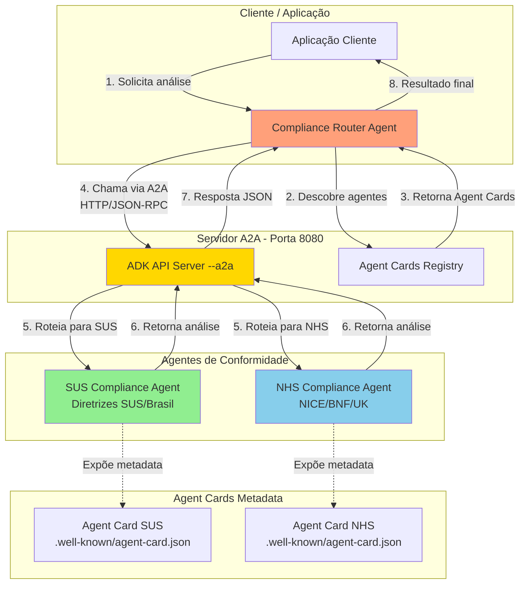

# Compliance Agents - Protocolo A2A

Este diretório contém agentes de conformidade para sistemas de saúde construídos com Google ADK (Agent Development Kit) e expostos via protocolo A2A (Agent-to-Agent).

## Visão Geral

Os agentes de conformidade analisam prescrições médicas e dados de pacientes para identificar potenciais problemas de segurança, interações medicamentosas, questões de dosagem e conformidade com diretrizes de saúde.

**Agentes Implementados:**

- **SUS Compliance Agent**: Avalia prescrições segundo as diretrizes do Sistema Único de Saúde (SUS) brasileiro
- **NHS Compliance Agent**: Valida prescrições conforme padrões do National Health Service (NHS) do Reino Unido, diretrizes NICE e BNF

## Arquitetura do Sistema

### Como Funciona o Protocolo A2A



### Fluxo de Comunicação

1. **Descoberta de Agentes**: Cliente consulta os Agent Cards em `/.well-known/agent-card.json`
2. **Invocação Remota**: Cliente faz chamada HTTP POST com JSON-RPC para o agente
3. **Processamento**: Agente processa a requisição usando LLM (Gemini)
4. **Resposta Estruturada**: Retorna análise em formato JSON seguindo o schema definido

### Agent Cards

Cada agente possui um **Agent Card** (arquivo JSON de metadata) que descreve:

- Nome e descrição do agente
- Modos de entrada/saída suportados
- Skills e capabilities disponíveis
- Versão do protocolo e preferências de transporte
- URL do endpoint do agente

**Exemplo de Agent Card:**

```json
{
  "name": "sus_compliance_agent",
  "description": "Agente especializado em avaliar prescrições no contexto do SUS",
  "url": "http://127.0.0.1:8080/a2a/sus",
  "protocolVersion": "0.3.0",
  "skills": [
    {
      "id": "sus_compliance_checking",
      "name": "SUS Compliance Checking",
      "description": "Analisa prescrições para conformidade e segurança no SUS"
    }
  ]
}
```

## Pré-requisitos

### Versão do Python

**Python 3.12** é obrigatório para compatibilidade com o A2A SDK.

```bash
# Instalar Python 3.12 usando uv (recomendado)
uv python install 3.12

# Verificar instalação
python --version  # Deve mostrar Python 3.12.x
```

### Dependências

Instalar os pacotes necessários:

```bash
# Dependências principais
pip install google-adk[a2a]  # Google Agent Development Kit com suporte A2A
pip install a2a-sdk           # SDK do protocolo A2A

# Ou usando uv (recomendado - mais rápido)
uv pip install google-adk[a2a] a2a-sdk
```

**Versões recomendadas:**
- `google-adk >= 1.16.0`
- `a2a-sdk >= 0.3.11`
- Python 3.12.x

### Setup Completo

1. **Criar ambiente virtual com Python 3.12:**
   ```bash
   uv venv --python 3.12
   source .venv/bin/activate  # No Windows: .venv\Scripts\activate
   ```

2. **Instalar todas as dependências:**
   ```bash
   uv pip install -r requirements.txt
   ```

## Estrutura do Projeto

```
compliance_agents/
├── README.md                    # Este arquivo
├── sus/                         # Agente de conformidade SUS
│   ├── agent.py                # Implementação do agente
│   ├── agent.json              # Metadata do Agent Card
│   └── __init__.py             # Exports do módulo
├── nhs/                         # Agente de conformidade NHS
│   ├── agent.py                # Implementação do agente
│   ├── agent.json              # Metadata do Agent Card
│   └── __init__.py             # Exports do módulo
```

## Como Executar

### Método 1: ADK API Server com Suporte A2A (Recomendado)

A forma mais simples de expor todos os agentes via A2A:

```bash
# A partir do diretório raiz do projeto
adk api_server --a2a --port 8080 compliance_agents
```

Isso irá:
- Iniciar um servidor HTTP na porta 8080
- Detectar automaticamente todos os agentes em `compliance_agents/`
- Expor os Agent Cards em:
  - SUS: `http://localhost:8080/a2a/sus/.well-known/agent-card.json`
  - NHS: `http://localhost:8080/a2a/nhs/.well-known/agent-card.json`

**Verificar se os agentes estão rodando:**

```bash
# Listar agentes disponíveis
curl http://localhost:8080/list-apps

# Obter Agent Card do SUS
curl http://localhost:8080/a2a/sus/.well-known/agent-card.json

# Obter Agent Card do NHS
curl http://localhost:8080/a2a/nhs/.well-known/agent-card.json
```

### Método 2: Agente Individual com Uvicorn

Para rodar um único agente com mais controle:

```python
# No agent.py, adicionar no final:
from google.adk.a2a.utils.agent_to_a2a import to_a2a

app = to_a2a(root_agent, agent_card="./compliance_agents/sus/agent.json")
```

Então executar com uvicorn:
```bash
uvicorn compliance_agents.sus.agent:app --port 8001
```

## Consumindo os Agentes via A2A

### Usando RemoteA2aAgent

De outro agente ou aplicação:

```python
from google.adk.agents.remote_a2a_agent import RemoteA2aAgent, AGENT_CARD_WELL_KNOWN_PATH

# Criar cliente do agente remoto
sus_client = RemoteA2aAgent(
    name="sus_compliance_client",
    description="Cliente para agente remoto de conformidade SUS",
    agent_card=f"http://localhost:8080/a2a/sus{AGENT_CARD_WELL_KNOWN_PATH}"
)

# Usar no seu agente
from google.adk.agents import LlmAgent

router_agent = LlmAgent(
    name="compliance_router",
    model="gemini-2.0-flash",
    sub_agents=[sus_client],
    instruction="Encaminhe análise de prescrição para o agente de conformidade SUS"
)
```

### Requisições HTTP Diretas

Você também pode chamar os agentes diretamente via JSON-RPC:

```bash
curl -X POST http://localhost:8080/a2a/sus \
  -H "Content-Type: application/json" \
  -d '{
    "jsonrpc": "2.0",
    "id": 1,
    "method": "execute",
    "params": {
      "input": "Dados do paciente e prescrição..."
    }
  }'
```

## Detalhes de Implementação

### SUS Compliance Agent

**Localização:** `compliance_agents/sus/agent.py`

**Capacidades:**
- Avalia prescrições conforme diretrizes e boas práticas do SUS
- Verifica interações medicamentosas, contraindicações e dosagem
- Considera disponibilidade no sistema público de saúde brasileiro
- Fornece recomendações para prescritores e farmacêuticos

**Schema de Saída:**
```python
{
  "system": "SUS",
  "overall_compliance": "compliant" | "review_required" | "non_compliant",
  "severity": "low" | "medium" | "high",
  "issues": [
    {
      "category": "drug_interaction" | "dose" | "contraindication" | ...,
      "description": "Descrição do problema",
      "sus_reference": "Referência às diretrizes SUS",
      "risk_level": "low" | "medium" | "high"
    }
  ],
  "recommendations": ["Recomendação 1", "Recomendação 2"],
  "notes_for_pharmacist": "Resumo para farmacêutico"
}
```

### NHS Compliance Agent

**Localização:** `compliance_agents/nhs/agent.py`

**Capacidades:**
- Valida conforme diretrizes NICE e recomendações BNF
- Verifica ajustes de dose renal/hepática
- Verifica conformidade com formulário
- Considera protocolos de segurança específicos do NHS

**Schema de Saída:**
```python
{
  "system": "NHS",
  "overall_compliance": "compliant" | "review_required" | "non_compliant",
  "severity": "low" | "medium" | "high",
  "issues": [
    {
      "category": "drug_interaction" | "dose" | "renal_adjustment" | ...,
      "description": "Descrição do problema",
      "nhs_reference": "Referência NICE/BNF",
      "risk_level": "low" | "medium" | "high"
    }
  ],
  "recommendations": ["Recomendação 1", "Recomendação 2"],
  "notes_for_pharmacist": "Resumo para farmacêutico"
}
```

## Testando os Agentes

### Usando Interface Web ADK

```bash
# Iniciar servidor A2A
adk api_server --a2a --port 8080 compliance_agents

# Em outro terminal, iniciar interface web
cd team
adk web
```

Acesse http://localhost:8000 e selecione o agente de conformidade.

### Usando CLI ADK

```bash
adk run compliance_agents/sus
```

Interaja com o agente via linha de comando.

### Usando Python

```python
from compliance_agents.sus.agent import root_agent

# Criar entrada
health_data = """
Paciente: Mulher, 65 anos, ClCr 45 mL/min
Medicações atuais: Metformina 1000mg 2x/dia
Nova prescrição: Glipizida 7.5mg VO diária
"""

# Executar agente
response = root_agent.execute(input=health_data)
print(response)
```

## Solução de Problemas

### Problema: Agent Cards retornam 404

**Solução:** Use `.well-known/agent-card.json` (não `agent.json`) como caminho do endpoint.

```bash
# Correto
curl http://localhost:8080/a2a/sus/.well-known/agent-card.json

# Incorreto
curl http://localhost:8080/a2a/sus/.well-known/agent.json
```

### Problema: ModuleNotFoundError: No module named 'a2a'

**Solução:** Instale o pacote correto:
```bash
pip install a2a-sdk  # NÃO pip install a2a
```

### Problema: Agentes não detectados pelo api_server

**Solução:** Verifique se os arquivos `__init__.py` exportam `root_agent`:
```python
from .agent import root_agent
__all__ = ["root_agent"]
```

### Problema: Incompatibilidade de versão do Python

**Solução:** Use Python 3.12:
```bash
uv python install 3.12
uv venv --python 3.12
source .venv/bin/activate
```

## Implantação em Produção

### Docker

Exemplo de Dockerfile:

```dockerfile
FROM python:3.12-slim

WORKDIR /app

# Instalar dependências
COPY requirements.txt .
RUN pip install --no-cache-dir -r requirements.txt

# Copiar código
COPY . .

# Expor porta
EXPOSE 8080

# Comando para iniciar servidor A2A
CMD ["adk", "api_server", "--a2a", "--port", "8080", "compliance_agents"]
```

Construir e executar:
```bash
docker build -t compliance-agents .
docker run -p 8080:8080 compliance-agents
```

### Cloud Run / Kubernetes

Os agentes podem ser implantados no Cloud Run ou Kubernetes. Certifique-se de:
- Porta 8080 exposta
- Health checks apontando para endpoint `/health`
- Variáveis de ambiente configuradas corretamente

**Exemplo de configuração Cloud Run:**
```yaml
apiVersion: serving.knative.dev/v1
kind: Service
metadata:
  name: compliance-agents
spec:
  template:
    spec:
      containers:
      - image: gcr.io/[PROJECT-ID]/compliance-agents
        ports:
        - containerPort: 8080
        env:
        - name: PORT
          value: "8080"
```

## Referências

- [Google ADK Documentation](https://cloud.google.com/agent-builder)
- [A2A Protocol Specification](https://github.com/google/a2a-sdk)
- [Agent Cards Standard](https://github.com/google/a2a-sdk/blob/main/docs/agent-cards.md)

---

**Construído com Google Agent Development Kit (ADK) e Protocolo A2A**
