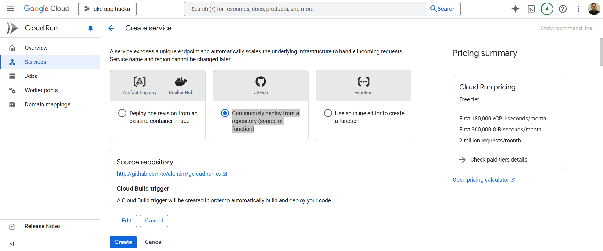
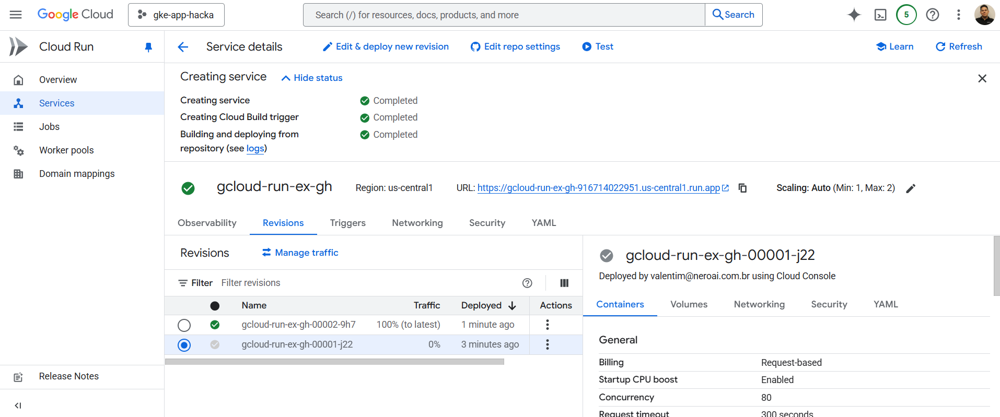

## Deploy from Repository

Here we'll explore deploying directly from GitHub using Cloud Run. We want to implement `continuous deployment` (CD) for our application.

To make this happen, after selecting `Create service` in Cloud Run, select the section "Continuously deploy from a repository (source or function)".

Next, authorize GCP to access your GitHub repository. After authorization, select the repository and branch you want to deploy. You'll see something like this: 

Finally, you'll see the same final screen, but without needing to create an image. You select the repository, the branch, and Cloud Run does the rest. Your final screen: 

## Conclusion

Congratulations! You've learned how to create a FastAPI, package it in a Docker container, and deploy it to Google Cloud Run. Additionally, you've configured continuous deployment directly from GitHub, making future application updates easier.
