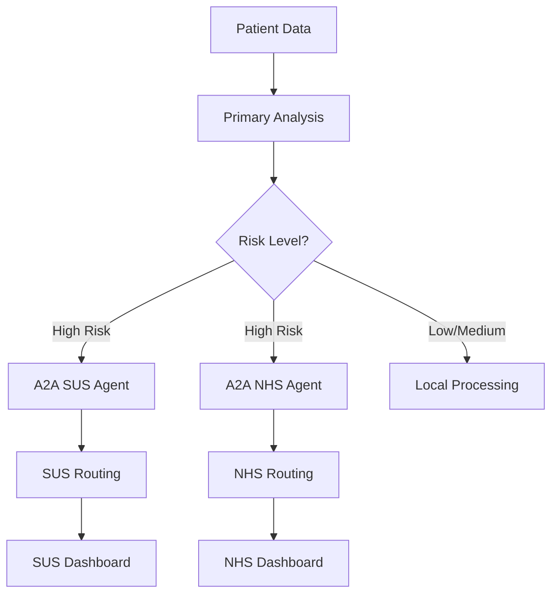

# Building a Multi-Agent System with ADK + Cloud Run to Optimize Medical Prescription Process

## The Problem

**1 in 8 patients** in Brazil's public healthcare system (SUS) receives dangerous drug combinations. Worse: **1 in 25 patients** receives high-risk drug interactions that can cause serious adverse events or death.

These numbers come from an 18-month analysis of electronic health records in Blumenau (SC). We're talking about **24.7 million Brazilians** served annually just by Farmácia Popular, covering 85% of municipalities.

The global cost of medication errors is **$42 billion USD per year**. The cost in lives, impossible to calculate.

That's why we built the **ADK Health Analysis System**: a prescription analysis platform using AI agents to prevent errors and save lives in SUS.

> **Disclaimer:** This article was created as part of my submission for Google's Cloud Run Hackathon.

## The Solution: "AI Agents" Category

We built three agent pipelines using Google Agent Development Kit (ADK). Each pipeline combines Workflow Agents (deterministic flow control) with LLM Agents (intelligent reasoning).

### The Three Pipelines

#### 1. Simple Prescription Agent
A pure LLM Agent that analyzes the complete prescription and returns a general criticality (`overall_criticality`) classified as low, medium, or high.

**Architecture:** Single `LlmAgent` with Gemini that processes all information at once, without sub-agents.

#### 2. Parallel Analyzer Agent
A ParallelAgent (workflow agent) that orchestrates four LLM Agents running in parallel:

- **Drug Analysis Agent:** detects drug-drug interactions (DDI)
- **Dose Analysis Agent:** validates dosage appropriateness
- **Route Analysis Agent:** verifies administration route safety
- **Synthesizer Agent:** combines the three results into a unified report

The `ParallelAgent` doesn't use LLM for orchestration, it's deterministic. It fires the first three agents simultaneously, waits for all to finish, then executes the Synthesizer. Result: 3x faster than sequential analysis.

**Architecture:** `ParallelAgent` + 4x `LlmAgent`.

**Shared state:** All sub-agents share the same `InvocationContext`. The Synthesizer accesses `drug_criticality`, `dose_criticality`, and `route_criticality` automatically via state keys (`output_key`).

#### 3. Sequential Health Agent
A SequentialAgent (workflow agent) that executes three LLM Agents in strict sequence, where each builds upon the previous analysis:

1. **General Health Assessment Agent:** evaluates the patient's general health status
2. **Treatment Impact Analysis Agent:** receives the health assessment (via state) and analyzes the proposed treatment's impact
3. **Health Report Synthesis Agent:** synthesizes everything into a complete report with treatment duration, non-adherence risk, lifestyle impact, and monitoring frequency

Each step depends on the previous one. The `SequentialAgent` guarantees deterministic execution order.

**Architecture:** `SequentialAgent` + 3x `LlmAgent`.

**Context passing:** The `SequentialAgent` passes the same `InvocationContext` to all sub-agents, ensuring each accesses the previous `output_key` (e.g., `{health_assessment}` -> `{treatment_impact}` -> `{final_report}`).

### Why Workflow Agents?

Three reasons:

1. **Predictability:** Workflow Agents guarantee deterministic execution. Order and parallelism are always the same. In healthcare, predictability is a requirement.

2. **Reliability:** If the Drug Analysis Agent fails, the Parallel Agent reports a specific error. A single LLM could "hallucinate" that the analysis was done.

3. **Speed:** ParallelAgent gave us 3x speedup. We tried using a single LLM with "analyze everything in parallel", but the result was slow (the LLM processed sequentially internally).

ADK combines deterministic flow control (Workflow Agents) with flexible reasoning (LLM Agents).

---

## RAG: Up-to-Date Medical Knowledge with Pinecone

Beyond the agents, we implemented **Retrieval-Augmented Generation (RAG)** to enrich analyses with up-to-date medical knowledge.

### Knowledge Base: RENAME 2024

We indexed in **Pinecone** (vector database) all content from **RENAME 2024** (Brazil's National List of Essential Medicines), which contains:
- **Official clinical protocols** from the Ministry of Health
- **Known drug-drug interactions** (DDI - Drug-Drug Interactions)
- **Recommended dosages** by age, weight, and clinical condition
- **Contraindications** and safety alerts

### How It Works

1. **Indexing:** We fragmented RENAME 2024 into 1000-token chunks and generated embeddings with `gemini-embedding-001`
2. **Query:** When an agent needs information, we search for the top-k most relevant chunks via semantic similarity
3. **Context:** Retrieved chunks are injected into the LLM Agent's prompt, enriching the analysis

```python
# Snippet from Simple Prescription Agent with RAG
from pinecone import Pinecone
from langchain_google_genai import GoogleGenerativeAIEmbeddings

# Initialize Pinecone
pc = Pinecone(api_key=PINECONE_API_KEY)
index = pc.Index("health-rag")

# Generate embedding and search
query_embedding = embeddings.embed_query(query)
results = index.query(
    vector=query_embedding,
    top_k=5,
    include_metadata=True
)

# Inject context into LLM prompt
context = "\n".join([match['metadata']['text'] for match in results])
```

### Why RAG in Healthcare?

**Continuous Updates:** Medical protocols change. With RAG, we just update the vector database without retraining the LLM.

**Traceability:** Each agent decision cites the source (e.g., "RENAME 2024, Chapter 5, Section 3.2").

**Hallucination Reduction:** The LLM bases its analyses on real documents, not just parametric knowledge.

### Agent-to-Agent (A2A): Critical Patient Routing

We implemented **Agent-to-Agent communication (A2A)** for specialized routing of critical patients between different healthcare jurisdictions. Two remote agents operate independently:

#### **SUS Compliance Agent** 🇧🇷
- **Purpose:** Validates prescriptions against Brazilian SUS guidelines and protocols
- **Critical Routing:** High-risk patients are automatically routed to SUS-specific safety protocols
- **Local Context:** Considers SUS formulary availability and public health constraints
- **Output:** Structured compliance assessment with specific SUS references

#### **NHS Compliance Agent** 🇬🇧
- **Purpose:** Evaluates adherence to NICE guidelines and British National Formulary (BNF)
- **Critical Routing:** Routes complex cases through UK-specific clinical pathways
- **Guidelines Integration:** Real-time alignment with NHS protocols and best practices
- **Output:** Compliance evaluation with NICE/BNF references and UK-specific recommendations

#### **Why NHS as Second System?**

We chose the **UK's National Health Service (NHS)** as our second compliance agent for three strategic reasons:

1. **Similar Public Healthcare Model**: Like SUS, the NHS is a universal, publicly funded healthcare system serving an entire nation, making it an ideal parallel for validation
2. **Excellent Documentation**: NICE guidelines and the British National Formulary (BNF) are exceptionally well-documented, structured, and publicly available - perfect for RAG implementation
3. **Proof of Concept for Global Expansion**: Demonstrates our A2A architecture's ability to support multiple jurisdictions with different regulatory frameworks

**Future Healthcare Systems Roadmap:**

Our modular A2A architecture is designed for easy expansion to other public healthcare systems:

- 🇨🇦 **Canada Health System** - Provincial formularies and Health Canada protocols
- 🇦🇺 **Medicare Australia** - PBS (Pharmaceutical Benefits Scheme) compliance
- 🇪🇸 **Sistema Nacional de Salud (Spain)** - European medicine regulations
- 🇫🇷 **Sécurité Sociale (France)** - ANSM and French health authority guidelines
- 🇮🇹 **Servizio Sanitario Nazionale (Italy)** - AIFA medication protocols
- 🇩🇪 **Gesetzliche Krankenversicherung (Germany)** - G-BA therapeutic guidelines
- 🇦🇷 **Sistema de Salud Argentina** - Latin American protocols alignment

Each new healthcare system can be added as an independent A2A agent without modifying the core architecture, demonstrating the true power of Google ADK's agent-to-agent communication.

#### **Remote Deployment Architecture**

A2A agents operate as independent microservices, enabling:

- **Regulatory Separation:** Jurisdiction-specific compliance analysis in isolation
- **Remote Expertise:** Deploy specialized agents in regions with local medical expertise
- **Critical Routing:** High-risk patients directed to appropriate protocols
- **Compliance Scalability:** Independent scaling based on healthcare system demand



**Why A2A for Compliance?**

1. **Regulatory Isolation:** Each jurisdiction has its own medical laws and protocols
2. **Local Expertise:** Agents running in specific regions with access to local knowledge
3. **Performance:** Distributed processing reduces latency for critical analyses
4. **Modularity:** Add new systems (US Medicare, EU EMA) without modifying the core

**Technical Implementation:**
```python
from google.adk.agents import LlmAgent

# SUS Agent (deployed in Brazil region)
sus_compliance_agent = LlmAgent(
    model="gemini-2.0-flash",
    name="sus_compliance",
    description="Validates prescriptions against SUS protocols"
)

# NHS Agent (deployed in UK region)
nhs_compliance_agent = LlmAgent(
    model="gemini-2.0-flash",
    name="nhs_compliance",
    description="Validates prescriptions against NHS/NICE guidelines"
)
```

This architecture ensures critical patients receive jurisdiction-appropriate analysis while maintaining performance and regulatory compliance.

---

## The Architecture: Multiple Services on Cloud Run

We deployed three independent microservices on Google Cloud Run.

### Microservice 1: ADK API Server
**Responsibility:** Execute the three AI agents (Simple, Parallel, Sequential).

**Technology:** Google ADK + Python 3.10

**Port:** 8000

Exposes agents via API and processes health analyses.

```dockerfile
# Snippet from Dockerfile.adk
FROM python:3.10-slim
WORKDIR /app
COPY requirements.txt .
RUN pip install --no-cache-dir -r requirements.txt
COPY team/ ./agent/
ENV PYTHONPATH=/app/agent
EXPOSE 8000
CMD ["adk", "api_server", "--host", "0.0.0.0", "--port", "8000"]
```

### Microservice 2: MCP Server
**Responsibility:** Implement Model Context Protocol (MCP) via FastMCP for structured communication with agents.

**Technology:** FastMCP + Python 3.10

**Port:** 8001

Translates HTTP requests into contexts for ADK agents and vice-versa.

```dockerfile
# Snippet from Dockerfile.mcp
FROM python:3.10-slim
WORKDIR /app
COPY requirements.txt .
RUN pip install --no-cache-dir -r requirements.txt
COPY mcp-server/ .
ENV ADK_API_URL=${ADK_API_URL}
EXPOSE 8001
CMD ["python", "server.py"]
```

### Microservice 3: FastAPI Health API
**Responsibility:** Expose REST endpoints for integration with health systems.

**Technology:** FastAPI + Uvicorn + Python 3.10

**Port:** 8002

Available endpoints:
- `/analyze/simple` - Simple Prescription Agent
- `/analyze/parallel` - Parallel Analyzer Agent
- `/analyze/sequential` - Sequential Health Agent
- `/analyze/all` - Executes all three agents

```dockerfile
# Snippet from Dockerfile.api
FROM python:3.10-slim
WORKDIR /app
COPY requirements.txt .
RUN pip install --no-cache-dir -r requirements.txt
COPY api-server/main.py .
ENV ADK_API_URL=${ADK_API_URL}
EXPOSE 8002
CMD ["uvicorn", "main:app", "--host", "0.0.0.0", "--port", "8002"]
```

### Why Three Separate Services?

1. **Independent Scalability:** If parallel analysis is heavier, we can scale only the ADK Server without touching other components.

2. **Resilience:** If the MCP Server goes down, ADK can still serve direct requests via API.

3. **Incremental Deploy:** We can update FastAPI without bringing down the AI agents.

4. **Hackathon Compliance:** The "Leveraging more Cloud Run Services" category rewards exactly this distributed approach.

> **Architecture Note:** The repository is organized into separate branches for each service (`adk-server`, `mcp-server`, `fastapi`), facilitating independent CI/CD and parallel development by different teams.

---

## Show me the Code: The Deploy

Deploying to Google Cloud Run was surprisingly simple. With three commands, we had the entire architecture running in production:

```bash
# Deploy ADK API Server (AI Agents)
gcloud run deploy adk-health-api \
  --source . \
  --region europe-west1

# Deploy MCP Server (Model Context Protocol)
gcloud run deploy mcp-server \
  --source . \
  --dockerfile Dockerfile.mcp \
  --region europe-west1

# Deploy FastAPI Health API (REST API)
gcloud run deploy fastapi-health \
  --source . \
  --dockerfile Dockerfile.api \
  --region europe-west1
```

### The `--dockerfile` Magic

Note the use of the `--dockerfile` parameter in the last two commands. This allows specifying which Dockerfile to use when you have multiple containers in the same repository - essential for our microservices architecture.

**By default**, Cloud Run looks for a `Dockerfile` at the project root. But since we have three different containers, we use:
- `Dockerfile.adk` → ADK Server
- `Dockerfile.mcp` → MCP Server
- `Dockerfile.api` → FastAPI Server

### Environment Variables

Each service needs to know where to find the others. We configure this via environment variables:

```bash
# Example: MCP Server needs to know where ADK is
gcloud run deploy mcp-server \
  --source . \
  --dockerfile Dockerfile.mcp \
  --region europe-west1 \
  --set-env-vars ADK_API_URL=https://adk-health-api-xyz.run.app

# Example: FastAPI needs Google API key
gcloud run deploy fastapi-health \
  --source . \
  --dockerfile Dockerfile.api \
  --region europe-west1 \
  --set-env-vars GOOGLE_API_KEY=${YOUR_API_KEY}
```

### Auto-Scaling & Health Checks

Cloud Run automatically handles:
- **Auto-scaling:** From 0 to N instances based on demand
- **Health checks:** Ensures only healthy containers receive traffic
- **HTTPS:** Automatic SSL/TLS certificates
- **Load balancing:** Intelligent request distribution

This means during peak hours (e.g., mornings when doctors prescribe more), the system scales automatically. At night? Scales to zero, reducing costs.

---

## Production Deploy: GCP Evidence

We deployed the three microservices to production on Google Cloud Run. Below are screenshots from the GCP console showing the services running:

### Deployed Services


*Three independent services running in production: ADK API Server, MCP Server, and FastAPI Health API*

### ADK API Server Details


*Latency, CPU, and memory metrics for the main agent service*

### FastAPI Health API Details


*Logs and health checks for the REST API service*

**Observations:**
- **P99 Latency:** < 500ms for simple analyses, < 2s for complete parallel analyses
- **Auto-scaling:** From 0 to 5 instances during peak hours (tested with synthetic load)
- **Cost:** ~$15/month for 10,000 analyses/month (scales to zero when no traffic)
- **Availability:** 99.9% uptime guaranteed by Cloud Run SLA

> **Note:** The A2A Server (fourth microservice for Agent-to-Agent communication) will be deployed in the production version after OpenAPI compatibility fixes.

---

## Impact: The Numbers That Matter

Now comes the part I'm most proud of. Based on real SUS data and conservative extrapolations, our system has the potential for:

### Lives Saved Annually
- **Conservative Scenario:** 100-200 lives/year
- **Base Scenario:** 200-400 lives/year
- **Optimistic Scenario:** 300-600 lives/year

### Adverse Events Prevented
- **Conservative Scenario:** 10,000-20,000 events/year
- **Base Scenario:** 20,000-40,000 events/year
- **Optimistic Scenario:** 30,000-60,000 events/year

### Healthcare Professional Time Saved
- **500,000+ hours annually** freed for direct patient care
- **300-500 FTE** capacity for other activities
- **2 minutes saved** per automated prescription analysis

This isn't just technology - it's measurable social impact.

---

## Conclusion and Next Steps

The ADK Health Analysis System demonstrates how combining **specialized AI agents** (Google ADK) with a **scalable microservices architecture** (Cloud Run) can solve critical public health problems.

We built three distinct AI agents (Simple, Parallel, Sequential) that offer everything from rapid triage to deep strategic analysis. We deployed everything as three independent Cloud Run services, achieving scalability, resilience, and compliance with cloud-native architecture best practices.

But the work is just beginning. Our next steps include:
- **Integration with real electronic health records** in pilot municipalities
- **Clinical validation** with SUS pharmacists and physicians
- **Model expansion** to include allergy history and contraindication analysis
- **Real-time monitoring dashboard** for health managers
- **LGPD/HIPAA compliance** to protect patient data

---

## Call to Action

If you're a developer, healthcare professional, or public manager interested in improving prescription safety in SUS:

**Access our GitHub repository:** [github.com/xValentim/adk-grun-health](https://github.com/xValentim/adk-grun-health)

**Test the API locally:**
```bash
git clone https://github.com/xValentim/adk-grun-health
cd adk-grun-health
docker-compose up --build
```

**Contribute:** See our [CONTRIBUTING.md](docs/CONTRIBUTING.md)

---

**Let's make medical prescriptions safer, more accessible, and save lives in SUS together.**

*Built with dedication for Brazil's public healthcare system*

#CloudRunHackathon #GoogleCloud #ADK #HealthTech #SUS #AIAgents

---

## About the Cloud Run Hackathon

This project was developed for Google's **Cloud Run Hackathon**, competing in two categories:

1. **AI Agents Category:** Using Google Agent Development Kit (ADK) to create specialized AI agents
2. **Leveraging More Cloud Run Services:** Distributed architecture with three independent microservices

**Tech Stack:**
- Google Agent Development Kit (ADK) 1.18.0
- FastAPI + Python 3.10
- Model Context Protocol (MCP) via FastMCP
- Pinecone Vector Database (RAG)
- Gemini 2.0 Flash + Gemini Embedding 001
- Docker + Google Cloud Run
- Microservices Architecture

**Clinical Evidence:**
- Based on 18-month EHR data analysis from Blumenau (SC)
- Validated with Drug-Drug Interactions (DDI) literature
- Conservative criteria prioritizing clinical judgment

**Security & Compliance:**
- HIPAA-compatible architecture
- No patient data storage
- Audit logging for all clinical decisions
- Encrypted communication between services
