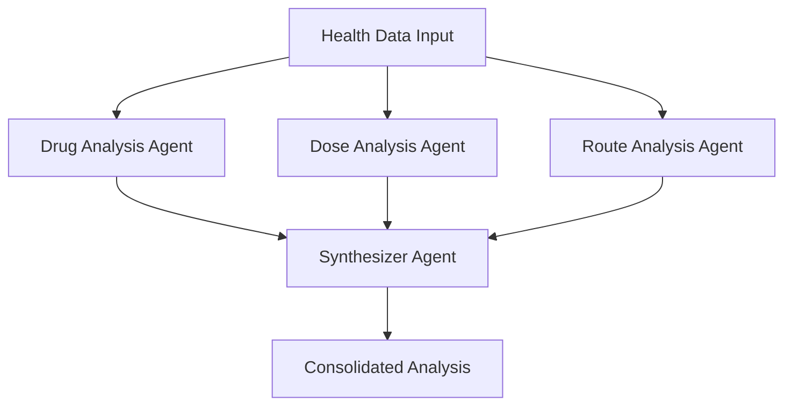
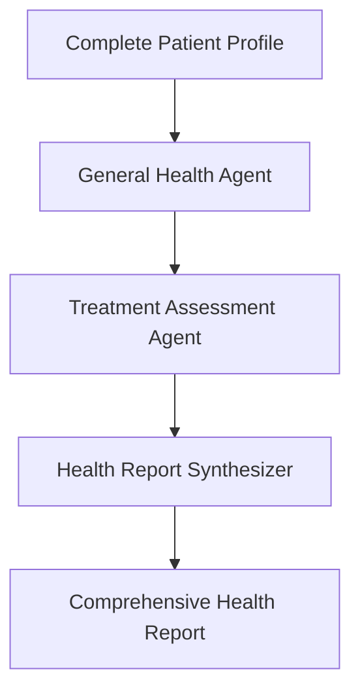

# 🤖 Agent Development Guide

## Agent Overview

Our health analysis system implements three distinct agent architectures, each optimized for different clinical analysis scenarios. All agents follow evidence-based clinical decision support principles with conservative evaluation criteria.

## Agent Types

### 1. Simple Prescription Agent
**Single-agent architecture for rapid safety assessment**

```python
# Location: team/simple_prescription_agent/agent.py
from adk import LlmAgent

class SimplePrescriptionAgent(LlmAgent):
    def __init__(self):
        super().__init__(
            system_instructions="""
            You are a clinical safety expert specializing in prescription analysis 
            for the Brazilian public healthcare system (SUS). Your role is to 
            perform rapid safety assessments while respecting clinical judgment.
            """
        )
```

**Clinical Focus:**
- Overall prescription safety level
- Basic drug-drug interaction screening
- Fundamental contraindication detection
- Conservative safety assessment

**Output Schema:**
```json
{
  "overall_criticality": "low|medium|high",
  "description": "Brief safety assessment summary"
}
```

### 2. Parallel Analyzer Agent
**Multi-agent parallel processing for specialized analysis**

```python
# Location: team/parallel_analyzer_agent/agent.py
class ParallelAnalyzerAgent(LlmAgent):
    def __init__(self):
        super().__init__(
            subagents=[
                DrugAnalysisAgent(),
                DoseDrugAnalysisAgent(), 
                RouteDrugAnalysisAgent(),
                SynthesizerAgent()
            ],
            parallel=True
        )
```

**Architecture Flow:**


#### Sub-Agents:

**Drug Analysis Agent**
```python
# Specializes in drug interaction detection
system_instructions = """
Analyze drug-drug interactions, contraindications, and therapeutic 
appropriateness. Focus on clinically significant interactions that 
require intervention or monitoring.
"""
```

**Dose Analysis Agent**  
```python
# Focuses on dosing appropriateness
system_instructions = """
Evaluate dosing regimens considering patient factors (age, weight, 
renal/hepatic function). Assess for overdosing, underdosing, and 
frequency appropriateness.
"""
```

**Route Analysis Agent**
```python
# Analyzes administration routes
system_instructions = """
Assess appropriateness of administration routes considering patient 
condition, drug properties, and clinical setting. Identify potential 
administration safety issues.
"""
```

**Synthesizer Agent**
```python
# Consolidates parallel analyses
system_instructions = """
Synthesize drug, dose, and route analyses into a comprehensive 
assessment. Prioritize the highest risk findings and provide 
actionable recommendations.
"""
```

**Output Schema:**
```json
{
  "level_drug": "low|medium|high",
  "level_dose": "low|medium|high", 
  "level_route": "low|medium|high",
  "description": "Synthesis of all three analysis dimensions"
}
```

### 3. Sequential Health Analyzer Agent
**Sequential pipeline for comprehensive health assessment**

```python
# Location: team/sequential_analyzer_agent/agent.py  
class SequentialAnalyzerAgent(LlmAgent):
    def __init__(self):
        super().__init__(
            subagents=[
                GeneralHealthAgent(),
                TreatmentAssessmentAgent(),
                SynthesizerHealthReportAgent()
            ],
            parallel=False  # Sequential execution
        )
```

**Architecture Flow:**


#### Sequential Sub-Agents:

**General Health Agent**
```python
# Analyzes patient health profile
system_instructions = """
Evaluate patient's general health status, comorbidities, and overall 
clinical picture. Consider age, gender, vital signs, lab values, and 
medical history for treatment appropriateness.
"""
```

**Treatment Assessment Agent**
```python
# Assesses treatment impact and duration
system_instructions = """
Analyze treatment duration appropriateness, potential for drug 
dependence, therapy monitoring requirements, and long-term 
treatment impacts on patient health.
"""
```

**Health Report Synthesizer**
```python
# Creates comprehensive health report
system_instructions = """
Generate actionable health assessment combining patient profile 
and treatment analysis. Focus on practical recommendations for 
healthcare providers with specific monitoring guidance.
"""
```

**Output Schema:**
```json
{
  "treatment_duration_criticality": "low|medium|high",
  "patient_compliance_criticality": "low|medium|high", 
  "lifestyle_impact_criticality": "low|medium|high",
  "monitoring_frequency_criticality": "low|medium|high",
  "executive_summary": "Comprehensive patient overview",
  "actionable_recommendations": "Specific provider actions"
}
```

## Clinical Decision Support Principles

### Conservative Evaluation Criteria
All agents implement relaxed, clinically-appropriate evaluation criteria:

```python
# Example from agent instructions
clinical_guidelines = """
EVALUATION APPROACH:
- Prioritize patient safety while respecting clinical judgment
- Avoid over-alerting on minor or theoretical interactions  
- Focus on clinically significant findings requiring action
- Consider Brazilian clinical context and available alternatives
- Provide education rather than rigid contraindications when appropriate
"""
```

### Risk Stratification
```python
risk_levels = {
    "low": "Minimal clinical concern, routine monitoring adequate",
    "medium": "Moderate concern, enhanced monitoring recommended", 
    "high": "Significant concern, immediate clinical review required"
}
```

### Clinical Context Integration
```python
# Brazilian SUS-specific considerations
clinical_context = """
- Consider medication availability in public formulary
- Account for resource limitations in public healthcare settings
- Prioritize cost-effective monitoring strategies
- Respect local prescribing practices and guidelines
- Focus on preventable adverse events with high impact
"""
```

## Agent Development Best Practices

### 1. Prompt Engineering
```python
# Structured prompt format
system_instructions = f"""
ROLE: [Clinical role and expertise]

CONTEXT: [Brazilian SUS context and constraints]

ANALYSIS APPROACH:
- [Specific analysis methodology]
- [Risk assessment criteria]  
- [Clinical judgment principles]

OUTPUT REQUIREMENTS:
- [Structured output format]
- [Required fields and validation]

EXAMPLES: [Clinical scenarios and expected responses]
"""
```

### 2. Error Handling
```python
# Robust error handling in agents
try:
    analysis_result = agent.analyze(patient_data)
except AnalysisError as e:
    return {
        "status": "error",
        "message": f"Analysis failed: {str(e)}",
        "fallback_recommendation": "Manual clinical review recommended"
    }
```

### 3. Validation and Testing
```python
# Agent output validation
def validate_agent_output(result: dict, agent_type: str) -> bool:
    required_fields = AGENT_SCHEMAS[agent_type]
    
    for field in required_fields:
        if field not in result:
            raise ValidationError(f"Missing required field: {field}")
            
    if "criticality" in result:
        if result["criticality"] not in ["low", "medium", "high"]:
            raise ValidationError("Invalid criticality level")
            
    return True
```

## Agent Configuration

### Environment Setup
```bash
# Each agent directory contains:
├── agent.py          # Main agent implementation
├── __init__.py      # Package initialization  
├── .env.example     # Environment template
├── tools.py         # Agent-specific tools (if needed)
└── __pycache__/     # Python cache
```

### Agent Registration
```python
# Agents are automatically discovered by ADK
# Based on directory structure in team/
AVAILABLE_AGENTS = {
    "simple_prescription_agent": SimplePrescriptionAgent,
    "parallel_analyzer_agent": ParallelAnalyzerAgent,  
    "sequential_analyzer_agent": SequentialAnalyzerAgent
}
```

### Session Management
```python
# Automatic session lifecycle
def run_agent(agent_name: str, input_data: str) -> dict:
    session_id = f"s_{uuid.uuid4().hex[:8]}"
    
    # 1. Create session
    create_session(agent_name, session_id)
    
    # 2. Execute agent  
    execute_agent(agent_name, session_id, input_data)
    
    # 3. Get results
    results = get_session_state(agent_name, session_id)
    
    # 4. Cleanup
    delete_session(agent_name, session_id)
    
    return results
```

## Testing Strategy

### Unit Testing
```python
# Test individual agent responses
def test_simple_agent_high_risk():
    agent = SimplePrescriptionAgent()
    
    high_risk_data = """
    Patient: Elderly male, 78 years
    Current medications: Warfarin, Aspirin, NSAIDs
    New prescription: Amiodarone
    """
    
    result = agent.analyze(high_risk_data)
    
    assert result["overall_criticality"] == "high"
    assert "interaction" in result["description"].lower()
```

### Integration Testing  
```python
# Test full agent pipeline
def test_parallel_agent_workflow():
    result = run_agent("parallel_analyzer_agent", test_data)
    
    # Verify all sub-agent outputs
    assert "level_drug" in result
    assert "level_dose" in result  
    assert "level_route" in result
    assert "description" in result
```

### Clinical Validation
```python
# Validate against known clinical scenarios
clinical_test_cases = [
    {
        "scenario": "Warfarin + Amiodarone interaction",
        "expected_criticality": "high",
        "rationale": "Known major DDI requiring dose adjustment"
    },
    {
        "scenario": "Metformin in mild renal impairment", 
        "expected_criticality": "medium",
        "rationale": "Requires monitoring, not absolute contraindication"
    }
]
```

This agent architecture provides flexible, clinically-informed analysis capabilities while maintaining the conservative, evidence-based approach needed for Brazilian public healthcare applications.