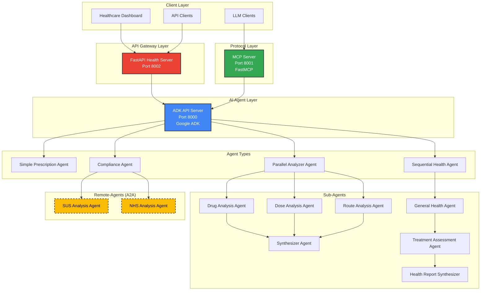
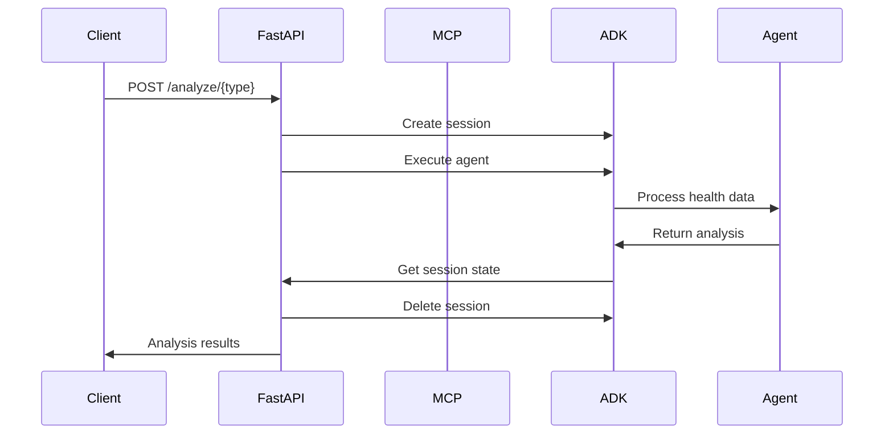
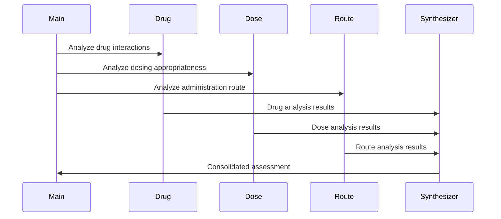

# 🏗️ Architecture Documentation

## System Overview

The ADK Health Analysis System is built on a microservices architecture with three main components that work together to provide comprehensive prescription safety analysis for Brazil's public healthcare system.

## Architecture Diagram



## Component Details

### 1. ADK API Server (Port 8000)
- **Framework**: Google Agent Development Kit
- **Purpose**: Core AI agent orchestration and execution
- **Features**: 
  - Agent lifecycle management
  - Session handling  
  - State management
  - Multi-agent coordination

### 2. MCP Server (Port 8001)
- **Framework**: FastMCP (Model Context Protocol)
- **Purpose**: Standardized AI tool interface
- **Features**:
  - Protocol-agnostic AI tool exposure
  - Health analysis function wrappers
  - Standardized tool descriptions

### 3. FastAPI Health Server (Port 8002)  
- **Framework**: FastAPI + Python 3.10
- **Purpose**: REST API for healthcare system integration
- **Features**:
  - Multiple analysis endpoints
  - Comprehensive error handling
  - CORS support
  - Health checks
  - Auto-documentation

## Agent Architecture

### Simple Prescription Agent
```
Input: Patient data + Current prescription
│
├── Clinical Context Analysis
├── Drug-Drug Interaction Check  
├── Basic Safety Assessment
│
Output: Overall criticality level (low/medium/high)
```

### Parallel Analyzer Agent
```
Input: Health data + Prescription list
│
├── Drug Analysis Agent ──┐
├── Dose Analysis Agent ──┼── Synthesizer Agent
├── Route Analysis Agent ─┘
│
Output: Individual criticality levels + synthesis
```

### Sequential Health Agent
```
Input: Complete patient profile
│
├── General Health Agent
│   │
│   ├── Treatment Assessment Agent  
│       │
│       ├── Health Report Synthesizer
│
Output: Comprehensive health impact report
```

## Data Flow

### 1. Request Processing


### 2. Multi-Agent Coordination


## Infrastructure Components

### Docker Configuration

#### ADK Container (`Dockerfile.adk`)
```dockerfile
# Multi-stage build for ADK agents
FROM python:3.10-slim
WORKDIR /app
COPY requirements.txt .
RUN pip install --no-cache-dir -r requirements.txt
COPY team/ ./agent/
ENV PYTHONPATH=/app/agent
EXPOSE 8000
CMD ["adk", "api_server", "--host", "0.0.0.0", "--port", "8000"]
```

#### MCP Container (`Dockerfile.mcp`)  
```dockerfile
# FastMCP server container
FROM python:3.10-slim
WORKDIR /app
COPY requirements.txt .
RUN pip install --no-cache-dir -r requirements.txt
COPY mcp-server/ .
EXPOSE 8001
CMD ["python", "server.py"]
```

#### FastAPI Container (`Dockerfile.api`)
```dockerfile
# REST API server container
FROM python:3.10-slim  
WORKDIR /app
COPY requirements.txt .
RUN pip install --no-cache-dir -r requirements.txt
COPY api-server/main.py .
EXPOSE 8002
CMD ["uvicorn", "main:app", "--host", "0.0.0.0", "--port", "8002"]
```

### Service Dependencies
```yaml
# docker-compose.yml dependency chain
adk-api:
  - Base service with health checks
  - Required by all other services

mcp-server:
  depends_on:
    adk-api:
      condition: service_healthy
      
fastapi-server:
  depends_on:
    adk-api:
      condition: service_healthy
```

## Cloud Run Deployment

### Service Configuration
- **Auto-scaling**: 0-1000 instances per service
- **Resource allocation**: 1 CPU, 2GB RAM per instance
- **Cold start optimization**: Keep-warm strategies
- **Health checks**: Custom endpoints for each service

### Inter-Service Communication
```
Cloud Run Service A → Cloud Run Service B
├── Internal URLs (no external traffic)
├── Authenticated requests
├── Circuit breaker patterns
└── Retry mechanisms with exponential backoff
```

## Security Architecture

### Network Security
- **Private container networking**
- **IAM-based service authentication** 
- **VPC connectors** for database access
- **TLS encryption** for all communications

### Data Protection
- **No persistent storage** of patient data
- **In-memory processing** only
- **Audit logging** for all clinical decisions
- **Session-based isolation**

## Monitoring & Observability

### Health Checks
- **ADK API**: `/list-apps` endpoint
- **MCP Server**: Tool availability check
- **FastAPI**: `/health` comprehensive check

### Logging Strategy
```python
# Structured logging across all services
{
  "timestamp": "2025-11-08T10:30:00Z",
  "service": "fastapi-health", 
  "level": "INFO",
  "agent_type": "parallel_analyzer",
  "session_id": "s_abc12345",
  "analysis_duration_ms": 2340,
  "criticality_detected": "medium"
}
```

### Metrics Collection
- **Request latency** per agent type
- **Analysis accuracy** tracking
- **Error rates** and failure patterns
- **Resource utilization** per service

## Scalability Considerations

### Horizontal Scaling
- **Stateless design** enables unlimited horizontal scaling
- **Session cleanup** prevents memory leaks
- **Load balancing** across agent instances

### Performance Optimization
- **Async processing** for I/O operations
- **Connection pooling** between services
- **Caching strategies** for common analyses
- **Batch processing** capabilities

## Development Workflow

### Local Development
```bash
# Start all services locally
docker-compose up --build

# Individual service development
docker-compose up adk-api  # Just ADK for agent development
```

### Testing Strategy
- **Unit tests** for individual agents
- **Integration tests** for service communication
- **End-to-end tests** for complete workflows
- **Load testing** for scalability validation

This architecture provides a robust, scalable foundation for delivering AI-powered prescription safety analysis to Brazil's healthcare system.