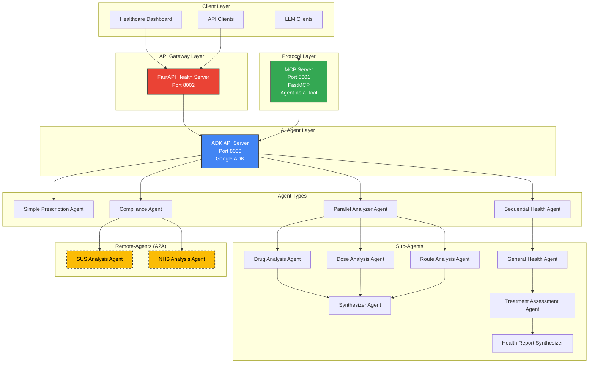

# 🏗️ Architecture Documentation

## System Overview

The ADK Health Analysis System is built on a microservices architecture with three main components that work together to provide comprehensive prescription safety analysis for Brazil's public healthcare system.

## Architecture Diagram



## Component Details

### 1. ADK API Server (Port 8000)
- **Framework**: Google Agent Development Kit
- **Purpose**: Core AI agent orchestration and execution
- **Features**: 
  - Agent lifecycle management
  - Session handling  
  - State management
  - Multi-agent coordination

### 2. MCP Server (Port 8001)
- **Framework**: FastMCP (Model Context Protocol)
- **Purpose**: Standardized AI tool interface
- **Features**:
  - Protocol-agnostic AI tool exposure
  - Health analysis function wrappers
  - Standardized tool descriptions

### 3. FastAPI Health Server (Port 8002)  
- **Framework**: FastAPI + Python 3.10
- **Purpose**: REST API for healthcare system integration
- **Features**:
  - Multiple analysis endpoints
  - Comprehensive error handling
  - CORS support
  - Health checks
  - Auto-documentation

### 4. Remote Compliance Agents A2A (Port 8003)  
- **Framework**: Google Agent Development Kit
- **Purpose**: Critical and Regulatory AI agent orchestration
- **Features**:
  - A2A communication protocols
  - Integration with external healthcare compliance systems (e.g., SUS, NHS)

## Agent Architecture

### Simple Prescription Agent
```
Input: Patient data + Current prescription
│
├── Clinical Context Analysis
├── Drug-Drug Interaction Check  
├── Basic Safety Assessment
│
Output: Overall criticality level (low/medium/high) + Description
```

### Parallel Analyzer Agent
```
Input: Health data + Prescription list
│
├── Drug Analysis Agent ──┐
├── Dose Analysis Agent ──┼── Synthesizer Agent
├── Route Analysis Agent ─┘
│
Output: Individual criticality levels (Drug, Dose and Route) + synthesis
```

### Sequential Health Agent
```
Input: Complete patient profile
│
├── General Health Agent
│   │
│   ├── Treatment Assessment Agent  
│       │
│       ├── Health Report Synthesizer
│
Output: Comprehensive health impact report
```

### Compliance Agent (Remote A2A)
```
Input: Prescription + Regulatory Guidelines
│
├── SUS Compliance Analysis (remote)
├── NHS Compliance Analysis (remote)
│
Output: Compliance reports for SUS and NHS guidelines
```

## Infrastructure Components

### Docker Configuration

#### ADK Container (`Dockerfile.adk`)
```dockerfile
# Dockerfile for ADK API Server
FROM python:3.10-slim

# Install system dependencies
RUN apt-get update && apt-get install -y \
    git \
    curl \
    && rm -rf /var/lib/apt/lists/*

# Create working directory
WORKDIR /app

# Copy requirements and install Python dependencies
COPY requirements.txt .
RUN pip install --no-cache-dir -r requirements.txt

# Copy agent code
COPY team/ ./agent/

# Set environment variables
ENV PYTHONPATH=/app/agent
ENV GOOGLE_API_KEY=${GOOGLE_API_KEY}

# Expose ADK port
EXPOSE 8000

# Command to start ADK API Server
WORKDIR /app/agent
CMD ["adk", "api_server", "--host", "0.0.0.0", "--port", "8000"]

```

#### MCP Container (`Dockerfile.mcp`)  
```dockerfile
# Dockerfile for MCP Server
FROM python:3.10-slim

# Instalar dependências do sistema se necessário
RUN apt-get update && apt-get install -y \
    && rm -rf /var/lib/apt/lists/*

# Criar diretório de trabalho
WORKDIR /app

# Copy requirements and install Python dependencies
COPY requirements.txt .
RUN pip install --no-cache-dir -r requirements.txt

# Copy MCP server code
COPY mcp-server/ .

# Definir variáveis de ambiente
ENV ADK_API_URL=${ADK_API_URL}
ENV PYTHONPATH=/app

# Expor a porta do MCP
EXPOSE 8001

# Comando para iniciar o MCP Server
CMD ["python", "server.py"]

```

#### FastAPI Container (`Dockerfile.api`)
```dockerfile
# Dockerfile for FastAPI Health Analysis Server
FROM python:3.10-slim

# Install system dependencies
RUN apt-get update && apt-get install -y \
    && rm -rf /var/lib/apt/lists/*

# Create working directory
WORKDIR /app

# Copy requirements from root and install Python dependencies
COPY requirements.txt .
RUN pip install --no-cache-dir -r requirements.txt

# Copy API code
COPY api-server/main.py .

# Set environment variables
ENV ADK_API_URL=${ADK_API_URL}
ENV PYTHONPATH=/app

# Expose FastAPI port
EXPOSE 8002

# Command to start FastAPI server
CMD ["uvicorn", "main:app", "--host", "0.0.0.0", "--port", "8002"]
```

#### A2A Container (`Dockerfile.a2a`)
```dockerfile
FROM python:3.10-slim

# System deps mínimos
RUN apt-get update && apt-get install -y --no-install-recommends \
    git curl \
 && rm -rf /var/lib/apt/lists/*

WORKDIR /app

# Copia apenas os reqs do serviço A2A
COPY requirements_a2a.txt .

RUN pip install --no-cache-dir -r requirements_a2a.txt

# Copia os agents
COPY compliance_agents ./compliance_agents

EXPOSE 8003

# Sobe o api_server do ADK apontando pros agents
CMD ["adk", "api_server", "--a2a", "--host", "0.0.0.0", "--port", "8003", "compliance_agents"]
```

### Service Dependencies
```yaml
# docker-compose.yml dependency chain
adk-api:
  - Base service with health checks
  - Required by all other services

adk-a2a:
  depends_on:
    adk-api:
      condition: service_healthy

mcp-server:
  depends_on:
    adk-a2a:
      condition: service_healthy
    adk-api:
      condition: service_healthy
      
fastapi-server:
  depends_on:
    adk-a2a:
      condition: service_healthy
    adk-api:
      condition: service_healthy
```

## Cloud Run Deployment

### Service Configuration
- **Auto-scaling**: 0-X instances per service
- **Resource allocation**: 1 CPU, 2GB RAM per instance
- **Cold start optimization**: Keep-warm strategies
- **Health checks**: Custom endpoints for each service

### Inter-Service Communication
```
Cloud Run Service A → Cloud Run Service B
├── Internal URLs (no external traffic)
├── Authenticated requests
├── Circuit breaker patterns
└── Retry mechanisms with exponential backoff
```

## Security Architecture

### Network Security
- **Private container networking**
- **IAM-based service authentication** 
- **VPC connectors** for database access
- **TLS encryption** for all communications

### Data Protection
- **No persistent storage** of patient data
- **In-memory processing** only
- **Audit logging** for all clinical decisions
- **Session-based isolation**

## Development Workflow

### Local Development
```bash
# Start all services locally
docker-compose up --build

# Individual service development
docker-compose up adk-api  # Just ADK for agent development
```

### Testing Strategy
- **Unit tests** for individual agents
- **Integration tests** for service communication
- **End-to-end tests** for complete workflows
- **Load testing** for scalability validation

This architecture provides a robust, scalable foundation for delivering AI-powered prescription safety analysis to Brazil's healthcare system.
