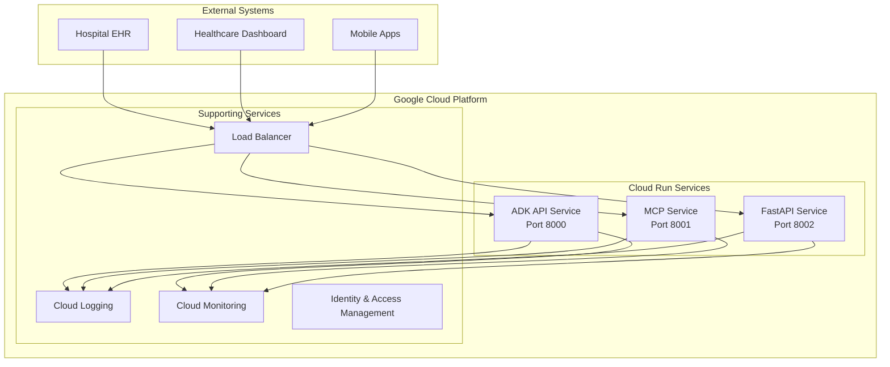

# 🚀 Deployment Guide

## Overview

The ADK Health Analysis System is designed for flexible deployment across development, staging, and production environments. This guide covers local development setup, Google Cloud Run deployment, and monitoring strategies.

## Deployment Architecture



## Local Development Deployment

### Prerequisites

- **Docker** 20.10+ and **Docker Compose** 2.0+
- **Python** 3.10+
- **Google API Key** for ADK functionality
- **Git** for version control

### Quick Start

```bash
# Clone the repository
git clone https://github.com/xValentim/adk-grun-health.git
cd adk-grun-health

# Set up environment variables
cp .env.example .env
# Edit .env with your GOOGLE_API_KEY

# Start all services
docker-compose up --build

# Verify deployment
curl http://localhost:8002/health
```

### Environment Configuration

Create `.env` file in the project root:

```env
# Google ADK Configuration
GOOGLE_API_KEY=your_google_api_key_here

# Service URLs (for local development)
ADK_API_URL=http://localhost:8000

# Optional: Custom ports
ADK_PORT=8000
MCP_PORT=8001
API_PORT=8002

# Development settings
LOG_LEVEL=INFO
ENVIRONMENT=development
```

### Service Startup Order

The docker-compose configuration ensures proper startup sequence:

```yaml
# docker-compose.yml
version: '3.8'

services:
  # 1. ADK API starts first with health checks
  adk-api:
    healthcheck:
      test: ["CMD", "curl", "-f", "http://localhost:8000/list-apps"]
      interval: 30s
      timeout: 10s
      retries: 5
      start_period: 40s

  # 2. MCP and FastAPI wait for ADK to be healthy
  mcp-server:
    depends_on:
      adk-api:
        condition: service_healthy

  fastapi-server:
    depends_on:
      adk-api:
        condition: service_healthy
```

### Development Workflow

```bash
# Start specific services for development
docker-compose up adk-api          # Just ADK for agent development
docker-compose up adk-api mcp-server # ADK + MCP for protocol testing

# View logs
docker-compose logs -f adk-api
docker-compose logs -f --tail=100 fastapi-server

# Rebuild after code changes
docker-compose up --build fastapi-server

# Clean restart
docker-compose down
docker-compose up --build
```

## Google Cloud Run Deployment

### Project Setup

```bash
# Install Google Cloud CLI
curl https://sdk.cloud.google.com | bash
exec -l $SHELL

# Initialize project
gcloud init
gcloud config set project your-project-id

# Enable required APIs
gcloud services enable run.googleapis.com
gcloud services enable containerregistry.googleapis.com
gcloud services enable cloudbuild.googleapis.com
```

### Build and Deploy Services

#### 1. Deploy ADK API Service

```bash
# Create Cloud Build configuration
cat > cloudbuild-adk.yaml << EOF
steps:
  - name: 'gcr.io/cloud-builders/docker'
    args: ['build', '-t', 'gcr.io/$PROJECT_ID/adk-health-api', '-f', 'Dockerfile.adk', '.']
  - name: 'gcr.io/cloud-builders/docker'
    args: ['push', 'gcr.io/$PROJECT_ID/adk-health-api']
  - name: 'gcr.io/cloud-builders/gcloud'
    args: 
      - 'run'
      - 'deploy'
      - 'adk-health-api'
      - '--image=gcr.io/$PROJECT_ID/adk-health-api'
      - '--region=us-central1'
      - '--allow-unauthenticated'
      - '--port=8000'
      - '--memory=2Gi'
      - '--cpu=1'
      - '--max-instances=100'
      - '--set-env-vars=GOOGLE_API_KEY=$_GOOGLE_API_KEY'
EOF

# Deploy ADK service
gcloud builds submit --config cloudbuild-adk.yaml \
  --substitutions _GOOGLE_API_KEY="your_google_api_key"
```

#### 2. Deploy MCP Server

```bash
# Get ADK service URL
ADK_URL=$(gcloud run services describe adk-health-api \
  --region=us-central1 --format="value(status.url)")

# Deploy MCP service
cat > cloudbuild-mcp.yaml << EOF
steps:
  - name: 'gcr.io/cloud-builders/docker'
    args: ['build', '-t', 'gcr.io/$PROJECT_ID/mcp-health-server', '-f', 'Dockerfile.mcp', '.']
  - name: 'gcr.io/cloud-builders/docker'
    args: ['push', 'gcr.io/$PROJECT_ID/mcp-health-server']
  - name: 'gcr.io/cloud-builders/gcloud'
    args:
      - 'run'
      - 'deploy' 
      - 'mcp-health-server'
      - '--image=gcr.io/$PROJECT_ID/mcp-health-server'
      - '--region=us-central1'
      - '--allow-unauthenticated'
      - '--port=8001'
      - '--memory=1Gi'
      - '--cpu=1'
      - '--max-instances=50'
      - '--set-env-vars=ADK_API_URL=$_ADK_URL'
EOF

gcloud builds submit --config cloudbuild-mcp.yaml \
  --substitutions _ADK_URL="$ADK_URL"
```

#### 3. Deploy FastAPI Service

```bash
# Deploy FastAPI service
cat > cloudbuild-api.yaml << EOF
steps:
  - name: 'gcr.io/cloud-builders/docker'
    args: ['build', '-t', 'gcr.io/$PROJECT_ID/fastapi-health-server', '-f', 'Dockerfile.api', '.']
  - name: 'gcr.io/cloud-builders/docker'
    args: ['push', 'gcr.io/$PROJECT_ID/fastapi-health-server']
  - name: 'gcr.io/cloud-builders/gcloud'
    args:
      - 'run'
      - 'deploy'
      - 'fastapi-health-server'
      - '--image=gcr.io/$PROJECT_ID/fastapi-health-server'
      - '--region=us-central1'
      - '--allow-unauthenticated'
      - '--port=8002'
      - '--memory=1Gi'
      - '--cpu=1'  
      - '--max-instances=100'
      - '--set-env-vars=ADK_API_URL=$_ADK_URL'
EOF

gcloud builds submit --config cloudbuild-api.yaml \
  --substitutions _ADK_URL="$ADK_URL"
```

### Automated Deployment Script

```bash
#!/bin/bash
# deploy-to-cloud-run.sh

set -e

PROJECT_ID="your-project-id"
REGION="us-central1"
GOOGLE_API_KEY="your_google_api_key"

echo "🚀 Deploying ADK Health Analysis System to Google Cloud Run"

# Deploy ADK API Service
echo "📦 Deploying ADK API Service..."
gcloud run deploy adk-health-api \
  --source . \
  --dockerfile Dockerfile.adk \
  --region $REGION \
  --allow-unauthenticated \
  --port 8000 \
  --memory 2Gi \
  --cpu 1 \
  --max-instances 100 \
  --set-env-vars GOOGLE_API_KEY=$GOOGLE_API_KEY

# Get ADK service URL
ADK_URL=$(gcloud run services describe adk-health-api \
  --region=$REGION --format="value(status.url)")

echo "✅ ADK API deployed at: $ADK_URL"

# Deploy MCP Server
echo "📦 Deploying MCP Server..."
gcloud run deploy mcp-health-server \
  --source . \
  --dockerfile Dockerfile.mcp \
  --region $REGION \
  --allow-unauthenticated \
  --port 8001 \
  --memory 1Gi \
  --cpu 1 \
  --max-instances 50 \
  --set-env-vars ADK_API_URL=$ADK_URL

# Get MCP service URL  
MCP_URL=$(gcloud run services describe mcp-health-server \
  --region=$REGION --format="value(status.url)")

echo "✅ MCP Server deployed at: $MCP_URL"

# Deploy FastAPI Service
echo "📦 Deploying FastAPI Service..."
gcloud run deploy fastapi-health-server \
  --source . \
  --dockerfile Dockerfile.api \
  --region $REGION \
  --allow-unauthenticated \
  --port 8002 \
  --memory 1Gi \
  --cpu 1 \
  --max-instances 100 \
  --set-env-vars ADK_API_URL=$ADK_URL

# Get FastAPI service URL
API_URL=$(gcloud run services describe fastapi-health-server \
  --region=$REGION --format="value(status.url)")

echo "✅ FastAPI Server deployed at: $API_URL"

echo "🎉 Deployment completed successfully!"
echo "📋 Service URLs:"
echo "   ADK API: $ADK_URL"
echo "   MCP Server: $MCP_URL" 
echo "   FastAPI: $API_URL"

# Test deployment
echo "🧪 Testing deployment..."
curl -f "$API_URL/health" && echo "✅ Health check passed"
```

## Production Configuration

### Security Hardening

```yaml
# production-docker-compose.yml
version: '3.8'

services:
  adk-api:
    environment:
      - ENVIRONMENT=production
      - LOG_LEVEL=WARNING
      - SECURITY_HEADERS=true
    deploy:
      resources:
        limits:
          cpus: '2.0'
          memory: 4G
        reservations:
          cpus: '1.0'
          memory: 2G
      restart_policy:
        condition: on-failure
        max_attempts: 3

  fastapi-server:
    environment:
      - CORS_ORIGINS=["https://yourdomain.com"]
      - API_RATE_LIMIT=100
      - ENABLE_METRICS=true
```

### Cloud Run Production Settings

```bash
# Production deployment with enhanced configuration
gcloud run deploy fastapi-health-server \
  --image gcr.io/$PROJECT_ID/fastapi-health-server \
  --region us-central1 \
  --no-allow-unauthenticated \
  --port 8002 \
  --memory 2Gi \
  --cpu 2 \
  --min-instances 2 \
  --max-instances 1000 \
  --concurrency 100 \
  --timeout 300 \
  --set-env-vars ENVIRONMENT=production \
  --set-env-vars LOG_LEVEL=INFO \
  --set-env-vars CORS_ORIGINS=https://healthdashboard.sus.gov.br
```

## Monitoring and Observability

### Health Checks

```python
# Enhanced health check implementation
@app.get("/health")
async def comprehensive_health_check():
    checks = {
        "api_status": "healthy",
        "adk_connection": "unknown", 
        "memory_usage": "unknown",
        "response_time": "unknown"
    }
    
    try:
        # Test ADK connectivity
        start_time = time.time()
        response = requests.get(f"{ADK_API_URL}/list-apps", timeout=5)
        response_time = time.time() - start_time
        
        if response.status_code == 200:
            checks["adk_connection"] = "healthy"
            checks["response_time"] = f"{response_time:.2f}s"
        else:
            checks["adk_connection"] = "unhealthy"
            
    except requests.RequestException as e:
        checks["adk_connection"] = f"error: {str(e)}"
    
    # Memory usage check
    import psutil
    memory_percent = psutil.virtual_memory().percent
    checks["memory_usage"] = f"{memory_percent:.1f}%"
    
    overall_status = "healthy" if checks["adk_connection"] == "healthy" else "degraded"
    
    return {
        "status": overall_status,
        "timestamp": datetime.utcnow().isoformat(),
        "checks": checks
    }
```

### Logging Configuration

```python
# Structured logging for production
import structlog

structlog.configure(
    processors=[
        structlog.stdlib.filter_by_level,
        structlog.stdlib.add_log_level,
        structlog.stdlib.add_logger_name,
        structlog.stdlib.PositionalArgumentsFormatter(),
        structlog.processors.TimeStamper(fmt="iso"),
        structlog.processors.StackInfoRenderer(),
        structlog.processors.format_exc_info,
        structlog.processors.UnicodeDecoder(),
        structlog.processors.JSONRenderer()
    ],
    context_class=dict,
    logger_factory=structlog.stdlib.LoggerFactory(),
    wrapper_class=structlog.stdlib.BoundLogger,
    cache_logger_on_first_use=True,
)

logger = structlog.get_logger()

# Usage in endpoints
@app.post("/analyze/simple")
async def simple_analysis(request: HealthDataRequest):
    logger.info(
        "analysis_started",
        agent_type="simple",
        request_size=len(request.health_data)
    )
    
    try:
        result = run_agent("simple_prescription_agent", request.health_data)
        
        logger.info(
            "analysis_completed", 
            agent_type="simple",
            criticality=result.get("results_criticality", {}).get("overall_criticality")
        )
        
        return AnalysisResponse(status="success", data=result)
        
    except Exception as e:
        logger.error(
            "analysis_failed",
            agent_type="simple", 
            error=str(e)
        )
        raise HTTPException(status_code=500, detail=str(e))
```

### Monitoring Setup

```bash
# Set up Cloud Monitoring alerts
gcloud alpha monitoring policies create \
  --notification-channels=$NOTIFICATION_CHANNEL \
  --display-name="Health API Error Rate" \
  --condition-display-name="High Error Rate" \
  --condition-filter='resource.type="cloud_run_revision" resource.labels.service_name="fastapi-health-server"' \
  --condition-comparison="COMPARISON_GT" \
  --condition-threshold-value=0.05 \
  --condition-threshold-duration=300s
```

## Backup and Disaster Recovery

### Configuration Backup

```bash
# Backup deployment configuration
mkdir -p backups/$(date +%Y-%m-%d)

# Export Cloud Run service configurations
gcloud run services describe adk-health-api \
  --region=us-central1 \
  --format="export" > backups/$(date +%Y-%m-%d)/adk-service.yaml

gcloud run services describe mcp-health-server \
  --region=us-central1 \
  --format="export" > backups/$(date +%Y-%m-%d)/mcp-service.yaml

gcloud run services describe fastapi-health-server \
  --region=us-central1 \
  --format="export" > backups/$(date +%Y-%m-%d)/api-service.yaml
```

### Disaster Recovery Plan

1. **Service Outage**: Auto-scaling and health checks provide automatic recovery
2. **Region Failure**: Deploy to secondary region with updated DNS
3. **Code Rollback**: Use Cloud Run revisions for immediate rollback
4. **Data Recovery**: No persistent data, only configuration recovery needed

## Performance Optimization

### Resource Allocation

```bash
# Optimized resource allocation for different services

# ADK API - CPU intensive (agent processing)
gcloud run services update adk-health-api \
  --cpu=2 \
  --memory=4Gi \
  --concurrency=50

# MCP Server - Lightweight protocol handler  
gcloud run services update mcp-health-server \
  --cpu=1 \
  --memory=1Gi \
  --concurrency=100

# FastAPI - High throughput REST API
gcloud run services update fastapi-health-server \
  --cpu=2 \
  --memory=2Gi \
  --concurrency=1000
```

### Scaling Configuration

```yaml
# Auto-scaling parameters
min_instances: 1      # Always warm for healthcare applications
max_instances: 1000   # Scale for high demand
concurrency: 100      # Requests per instance
cpu_throttling: false # Ensure consistent performance
```

This deployment guide ensures reliable, scalable operation of the health analysis system across development and production environments.